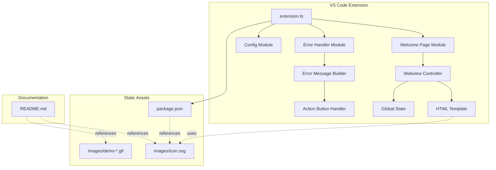
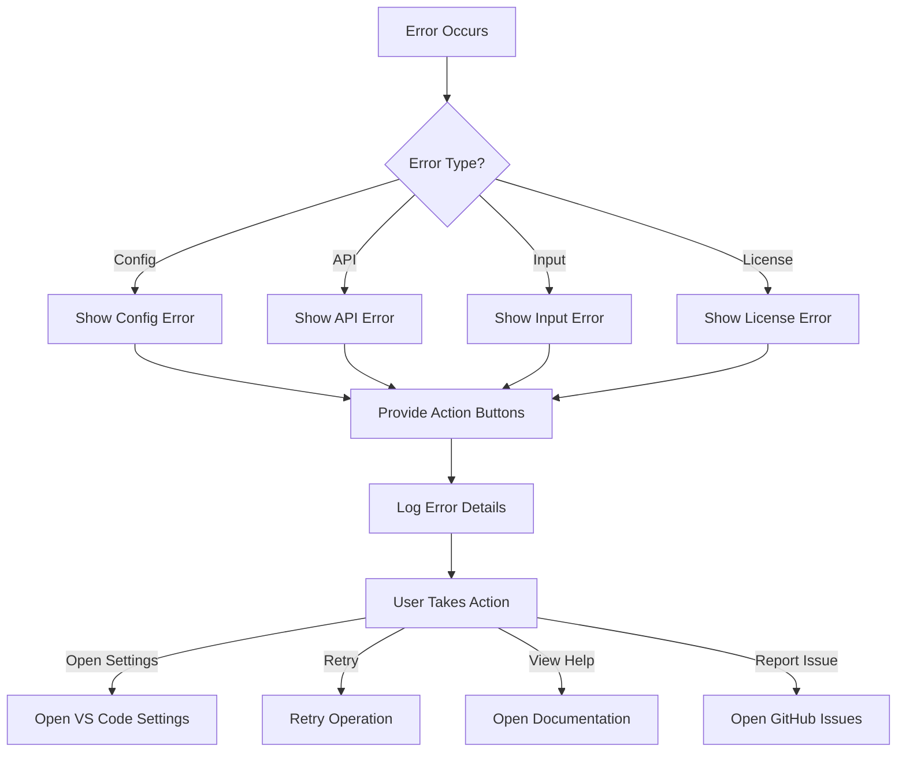

# Design Document: Marketplace Preparation

## Overview

本设计文档描述了 Reference Manager Pro 插件发布到 VS Code Marketplace 前的准备工作实现方案。该方案包括五个主要模块：

1. **视觉资产创建** - 插件图标和演示动画
2. **Package Manifest 增强** - 完善 package.json 元数据
3. **欢迎页面系统** - 首次安装引导体验
4. **错误处理增强** - 友好的双语错误提示
5. **文档集成** - README 和资源文件管理

这些模块共同提升插件的市场吸引力、用户体验和专业形象。

## Architecture

### 系统架构图




### 模块职责

**Welcome Page Module** (`src/webview/welcome.ts`)
- 管理欢迎页面的生命周期
- 使用 VS Code Webview API 创建和显示 HTML 内容
- 通过 Global State 跟踪是否已显示过欢迎页面
- 提供手动显示欢迎页面的命令

**Error Handler Module** (`src/errorHandler.ts`)
- 构建友好的双语错误消息
- 创建可点击的操作按钮
- 根据错误类型提供具体的解决方案
- 记录详细的调试信息

**Icon Asset** (`images/icon.svg`)
- 128x128px SVG 格式
- 学术风格设计（书籍/引用/AI 元素）
- 适配明暗主题

**Demo GIFs** (`images/demo-*.gif`)
- 展示核心功能的动画
- 优化文件大小（< 5MB）
- 清晰的操作演示

**Package Manifest Enhancement** (`package.json`)
- 添加图标引用
- 配置 Gallery Banner
- 优化关键词和元数据

## Components and Interfaces

### Welcome Page Module

#### WelcomePageController

```typescript
/**
 * 欢迎页面控制器
 * 负责创建、显示和管理欢迎页面的 Webview
 */
export class WelcomePageController {
    private panel: vscode.WebviewPanel | undefined;
    private context: vscode.ExtensionContext;
    
    constructor(context: vscode.ExtensionContext);
    
    /**
     * 显示欢迎页面
     * 如果已经显示则聚焦，否则创建新的 Webview
     */
    public show(): void;
    
    /**
     * 检查是否应该显示欢迎页面（首次安装）
     */
    public shouldShowOnStartup(): boolean;
    
    /**
     * 标记欢迎页面已显示
     */
    public markAsShown(): void;
    
    /**
     * 生成 HTML 内容
     */
    private getHtmlContent(): string;
    
    /**
     * 处理来自 Webview 的消息
     */
    private handleMessage(message: any): void;
}
```


#### Welcome Page HTML Structure

```html
<!DOCTYPE html>
<html>
<head>
    <meta charset="UTF-8">
    <meta name="viewport" content="width=device-width, initial-scale=1.0">
    <title>Welcome to Reference Manager Pro</title>
    <style>
        /* 使用 VS Code CSS 变量 */
        body {
            font-family: var(--vscode-font-family);
            color: var(--vscode-foreground);
            background-color: var(--vscode-editor-background);
        }
        /* 更多样式... */
    </style>
</head>
<body>
    <div class="container">
        <header>
            
            <h1>Welcome to Reference Manager Pro</h1>
            <p class="tagline">AI-powered LaTeX bibliography management</p>
        </header>
        
        <section class="quick-start">
            <h2>Quick Start</h2>
            <ol>
                <li>Configure your API Key</li>
                <li>Open a .bib file</li>
                <li>Select an entry and format it</li>
            </ol>
        </section>
        
        <section class="features">
            <h2>Features</h2>
            <div class="feature-grid">
                <!-- Feature cards -->
            </div>
        </section>
        
        <footer>
            <button id="getStarted">Get Started</button>
            <label>
                <input type="checkbox" id="dontShowAgain" />
                Don't show again
            </label>
        </footer>
    </div>
    
    <script>
        const vscode = acquireVsCodeApi();
        // Message handling...
    </script>
</body>
</html>
```

### Error Handler Module

#### ErrorMessageBuilder

```typescript
/**
 * 错误类型枚举
 */
export enum ErrorType {
    API_KEY_MISSING = 'api_key_missing',
    API_KEY_INVALID = 'api_key_invalid',
    API_TIMEOUT = 'api_timeout',
    API_RATE_LIMIT = 'api_rate_limit',
    NETWORK_ERROR = 'network_error',
    PARSE_ERROR = 'parse_error',
    NO_SELECTION = 'no_selection',
    LICENSE_INVALID = 'license_invalid',
    UNKNOWN = 'unknown'
}

/**
 * 错误消息配置
 */
export interface ErrorMessageConfig {
    type: ErrorType;
    details?: string;
    technicalMessage?: string;
}

/**
 * 操作按钮配置
 */
export interface ActionButton {
    label: string;
    action: () => Promise<void>;
}

/**
 * 错误消息构建器
 */
export class ErrorMessageBuilder {
    /**
     * 构建友好的错误消息
     */
    public static buildMessage(config: ErrorMessageConfig): string;
    
    /**
     * 获取错误的操作按钮
     */
    public static getActions(type: ErrorType): ActionButton[];
    
    /**
     * 显示错误消息和操作按钮
     */
    public static async showError(config: ErrorMessageConfig): Promise<void>;
}
```


#### Error Message Templates

```typescript
/**
 * 错误消息模板（中英文双语）
 */
export const ERROR_TEMPLATES: Record<ErrorType, {
    title: string;
    message: string;
    solutions: string[];
}> = {
    [ErrorType.API_KEY_MISSING]: {
        title: 'API Key 未配置 (API Key Not Configured)',
        message: '您需要配置 API Key 才能使用 AI 功能。',
        solutions: [
            '1. 点击下方"打开设置"按钮',
            '2. 选择 AI 提供商（推荐 Groq，免费）',
            '3. 输入对应的 API Key',
            '4. 保存设置后重试'
        ]
    },
    [ErrorType.API_KEY_INVALID]: {
        title: 'API Key 无效 (Invalid API Key)',
        message: 'API Key 验证失败，请检查配置。',
        solutions: [
            '1. 确认 Key 完整复制（无空格）',
            '2. 确认选择了正确的 AI 提供商',
            '3. 检查 Key 是否已过期',
            '4. 尝试重新生成 Key'
        ]
    },
    [ErrorType.API_TIMEOUT]: {
        title: 'API 请求超时 (API Timeout)',
        message: 'API 请求超时，可能是网络问题。',
        solutions: [
            '1. 检查网络连接',
            '2. 稍后重试',
            '3. 尝试使用本地格式化功能'
        ]
    },
    [ErrorType.API_RATE_LIMIT]: {
        title: 'API 速率限制 (Rate Limit Exceeded)',
        message: 'API 调用频率过高，请稍后再试。',
        solutions: [
            '1. 等待 1-2 分钟后重试',
            '2. 考虑升级到 Pro 版本',
            '3. 使用本地格式化功能'
        ]
    },
    [ErrorType.NETWORK_ERROR]: {
        title: '网络错误 (Network Error)',
        message: '无法连接到 API 服务器。',
        solutions: [
            '1. 检查网络连接',
            '2. 检查防火墙设置',
            '3. 尝试使用 VPN',
            '4. 使用本地格式化功能'
        ]
    },
    [ErrorType.PARSE_ERROR]: {
        title: 'BibTeX 解析错误 (Parse Error)',
        message: 'BibTeX 条目格式不正确。',
        solutions: [
            '1. 检查条目的括号是否匹配',
            '2. 确认字段格式正确',
            '3. 查看详细错误信息'
        ]
    },
    [ErrorType.NO_SELECTION]: {
        title: '未选择内容 (No Selection)',
        message: '请先选择要处理的 BibTeX 条目。',
        solutions: [
            '1. 在编辑器中选择一个完整的 BibTeX 条目',
            '2. 确保选择了 @article{...} 等完整内容',
            '3. 重新执行命令'
        ]
    },
    [ErrorType.LICENSE_INVALID]: {
        title: 'License 无效 (Invalid License)',
        message: 'License Key 验证失败。',
        solutions: [
            '1. 检查 Key 是否完整复制',
            '2. 确认 Key 未过期',
            '3. 联系支持获取帮助'
        ]
    }
};
```

## Data Models

### Global State Keys

```typescript
/**
 * Global State 存储键
 */
export const GLOBAL_STATE_KEYS = {
    /** 是否已显示欢迎页面 */
    WELCOME_SHOWN: 'welcomePageShown',
    /** 欢迎页面显示次数 */
    WELCOME_SHOW_COUNT: 'welcomeShowCount',
    /** 上次显示欢迎页面的时间 */
    WELCOME_LAST_SHOWN: 'welcomeLastShown'
} as const;
```

### Package.json Enhancements

```json
{
  "icon": "images/icon.png",
  "galleryBanner": {
    "color": "#1e3a8a",
    "theme": "dark"
  },
  "badges": [
    {
      "url": "https://img.shields.io/visual-studio-marketplace/v/EI.reference-manager-pro",
      "href": "https://marketplace.visualstudio.com/items?itemName=EI.reference-manager-pro",
      "description": "Version"
    },
    {
      "url": "https://img.shields.io/visual-studio-marketplace/d/EI.reference-manager-pro",
      "href": "https://marketplace.visualstudio.com/items?itemName=EI.reference-manager-pro",
      "description": "Downloads"
    },
    {
      "url": "https://img.shields.io/visual-studio-marketplace/r/EI.reference-manager-pro",
      "href": "https://marketplace.visualstudio.com/items?itemName=EI.reference-manager-pro",
      "description": "Rating"
    }
  ],
  "keywords": [
    "latex", "bibtex", "bibliography", "reference", "citation",
    "ai", "formatting", "academic", "research", "paper",
    "thesis", "dissertation", "claude", "anthropic", "groq",
    "literature", "publication", "scholar", "arxiv", "doi"
  ],
  "homepage": "https://github.com/tryandaction/reference-manager-pro#readme",
  "bugs": {
    "url": "https://github.com/tryandaction/reference-manager-pro/issues"
  },
  "repository": {
    "type": "git",
    "url": "https://github.com/tryandaction/reference-manager-pro"
  }
}
```


### Icon Design Specifications

```typescript
/**
 * 图标设计规范
 */
export const ICON_SPECS = {
    /** 尺寸 */
    SIZE: 128,
    /** 格式 */
    FORMAT: 'SVG',
    /** 导出格式 */
    EXPORT_FORMATS: ['SVG', 'PNG'],
    /** 颜色方案 */
    COLOR_SCHEME: {
        PRIMARY: '#1e3a8a',      // 深蓝色
        SECONDARY: '#3b82f6',    // 亮蓝色
        ACCENT: '#60a5fa',       // 天蓝色
        DARK: '#1e293b',         // 深色背景用
        LIGHT: '#f8fafc'         // 浅色背景用
    },
    /** 设计元素 */
    ELEMENTS: [
        'Book/Document icon',
        'Citation/Quote marks',
        'AI/Brain/Sparkle symbol'
    ]
} as const;
```

### Demo GIF Specifications

```typescript
/**
 * 演示 GIF 规范
 */
export const DEMO_SPECS = {
    /** 最大文件大小（字节） */
    MAX_FILE_SIZE: 5 * 1024 * 1024, // 5MB
    /** 推荐尺寸 */
    DIMENSIONS: {
        WIDTH: 800,
        HEIGHT: 600
    },
    /** 帧率 */
    FPS: 10,
    /** 演示场景 */
    SCENARIOS: [
        {
            name: 'AI Format',
            file: 'demo-ai-format.gif',
            description: 'Demonstrate AI-powered BibTeX formatting'
        },
        {
            name: 'Find Unused',
            file: 'demo-find-unused.gif',
            description: 'Show unused citation detection'
        },
        {
            name: 'Remove Duplicates',
            file: 'demo-remove-duplicates.gif',
            description: 'Display duplicate removal process'
        },
        {
            name: 'Local Format',
            file: 'demo-local-format.gif',
            description: 'Show local formatting without API'
        }
    ]
} as const;
```


## Correctness Properties

*A property is a characteristic or behavior that should hold true across all valid executions of a system—essentially, a formal statement about what the system should do. Properties serve as the bridge between human-readable specifications and machine-verifiable correctness guarantees.*

### Property 1: Demo GIF File Size Limit

*For any* demo GIF file in the images directory, the file size should be less than 5MB.

**Validates: Requirements 2.5**

### Property 2: Package Manifest Keyword Count

*For any* valid package.json file, the keywords array should contain at least 15 elements.

**Validates: Requirements 3.4**

### Property 3: Welcome Page First-Time Display

*For any* extension activation where the welcome page has never been shown (global state indicates first install), the welcome page should be displayed automatically.

**Validates: Requirements 4.1**

### Property 4: Welcome Page State Persistence

*For any* welcome page close action, the global state should be updated to record that the welcome page has been shown.

**Validates: Requirements 4.9**

### Property 5: Welcome Page No Repeat Display

*For any* extension activation where the welcome page has been shown before (global state indicates it was shown), the welcome page should NOT be displayed automatically.

**Validates: Requirements 4.10**

### Property 6: Error Message Bilingual Format

*For any* error message displayed to the user, the message should contain both Chinese text and English text in parentheses.

**Validates: Requirements 5.1**

### Property 7: Error Message Diagnostic Information

*For any* API error, the error message should include detailed diagnostic information about the failure.

**Validates: Requirements 5.3**

### Property 8: Error Message Action Buttons

*For any* error message displayed to the user, the system should provide clickable action buttons for common remediation steps.

**Validates: Requirements 5.4**

### Property 9: Error Message Solution Suggestions

*For any* common error type (API key missing, timeout, rate limit, etc.), the error message should include specific solution suggestions.

**Validates: Requirements 5.5**

### Property 10: Error Message Documentation Links

*For any* error message displayed to the user, the message should include links to relevant documentation or help pages.

**Validates: Requirements 5.6**

### Property 11: Error Type Distinction

*For any* API request failure, the error message should correctly distinguish between network errors, authentication errors, and service errors based on the failure type.

**Validates: Requirements 5.7**

### Property 12: Error Logging

*For any* error that occurs, the system should log detailed error information (including stack traces and context) for debugging purposes.

**Validates: Requirements 5.9**

### Property 13: Images Directory Creation

*For any* system state where the images directory does not exist, creating the directory should result in the directory existing at the expected path.

**Validates: Requirements 7.1**

### Property 14: Resource File Location

*For any* resource file (icon or demo GIF), the file should be stored in the images directory.

**Validates: Requirements 7.2, 7.3**


## Error Handling

### Error Categories

1. **Configuration Errors**
   - Missing API keys
   - Invalid API keys
   - Wrong provider selection

2. **API Errors**
   - Network connectivity issues
   - Request timeouts
   - Rate limiting
   - Service unavailability
   - Authentication failures

3. **User Input Errors**
   - No selection made
   - Invalid BibTeX format
   - Empty input

4. **License Errors**
   - Invalid license key
   - Expired license
   - Feature not available in free version

### Error Handling Strategy

**Graceful Degradation:**
- When AI features fail, suggest local formatting alternative
- When network is unavailable, provide offline functionality guidance
- When rate limited, suggest waiting or upgrading

**User-Friendly Messages:**
- All errors in Chinese with English translation
- Avoid technical jargon
- Provide actionable solutions
- Include relevant links

**Logging:**
- Log all errors with full context
- Include timestamps and user actions
- Preserve stack traces for debugging
- Respect user privacy (no sensitive data in logs)

**Recovery Actions:**
- Provide "Open Settings" button for configuration errors
- Provide "Retry" button for transient errors
- Provide "View Help" button for complex issues
- Provide "Report Issue" link for bugs

### Error Message Flow



## Testing Strategy

### Unit Testing

Unit tests will verify specific examples and edge cases:

**Welcome Page Tests:**
- Verify HTML structure contains required elements
- Verify CSS uses VS Code variables
- Verify message handling works correctly
- Verify global state is updated on close

**Error Handler Tests:**
- Verify each error type produces correct message
- Verify action buttons are created correctly
- Verify bilingual format is maintained
- Verify logging occurs for all errors

**Package.json Tests:**
- Verify icon field points to correct path
- Verify galleryBanner is configured
- Verify badges array is populated
- Verify keywords count >= 15
- Verify URLs are correct

**File System Tests:**
- Verify images directory is created
- Verify icon files exist
- Verify GIF files exist
- Verify file paths are relative

### Property-Based Testing

Property tests will verify universal properties across all inputs:

**Configuration:** Minimum 100 iterations per property test

**Property Test Tags:** Each test must reference its design property
- Format: `// Feature: marketplace-preparation, Property N: [property text]`

**Test Coverage:**
- Property 1: Test multiple GIF files with various sizes
- Property 2: Test package.json with different keyword counts
- Property 3-5: Test welcome page behavior with different global states
- Property 6-12: Test error messages with various error types
- Property 13-14: Test file system operations with different states

### Integration Testing

Integration tests will verify end-to-end workflows:

1. **First Install Flow:**
   - Install extension → Welcome page shows → Close page → State saved → Reactivate → Page doesn't show

2. **Error Recovery Flow:**
   - Trigger error → See error message → Click action button → Problem resolved

3. **Asset Loading Flow:**
   - Package extension → Verify all assets included → Install → Verify assets accessible

### Manual Testing Checklist

- [ ] Icon displays correctly in VS Code extension list
- [ ] Icon displays correctly on Marketplace
- [ ] Demo GIFs play correctly in README
- [ ] Welcome page displays correctly in light theme
- [ ] Welcome page displays correctly in dark theme
- [ ] All error messages are bilingual
- [ ] All action buttons work correctly
- [ ] Package metadata displays correctly on Marketplace

